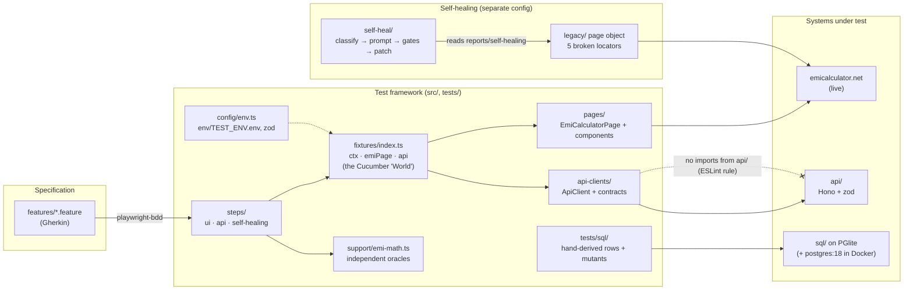
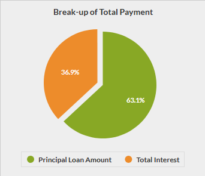
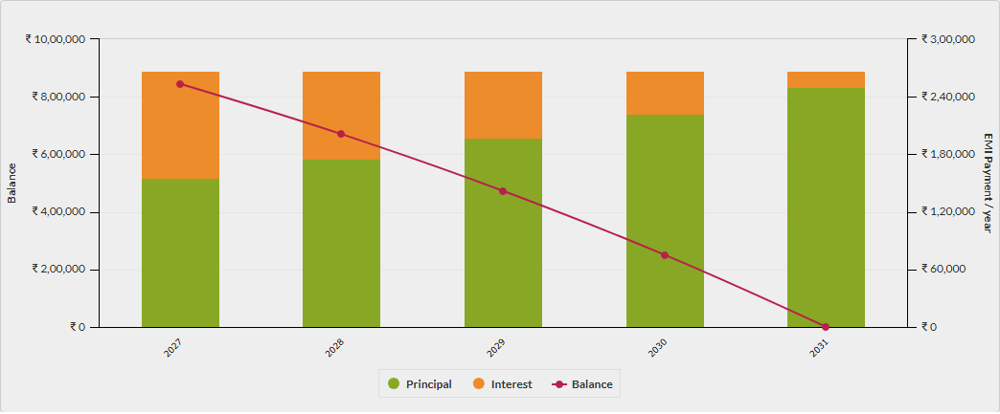
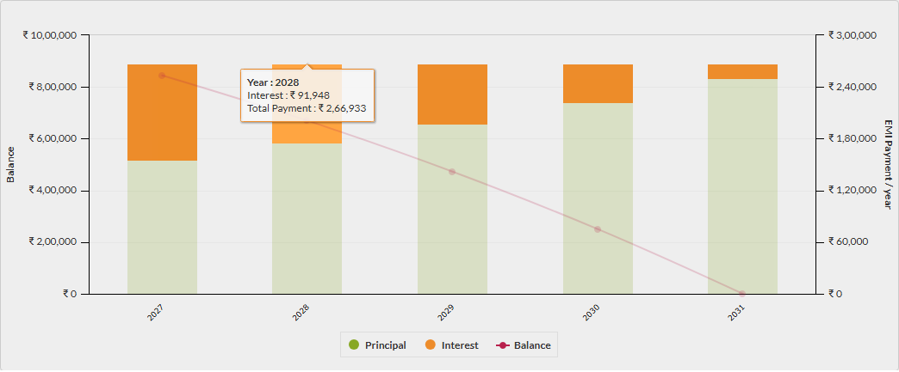
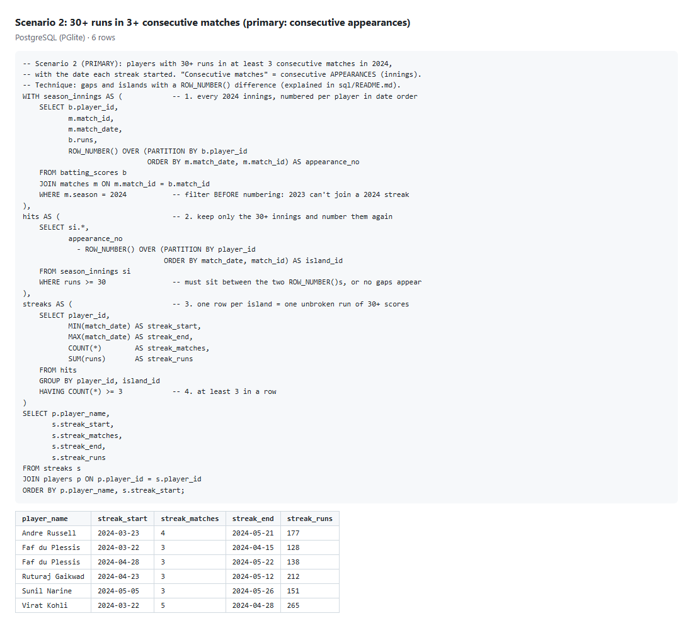
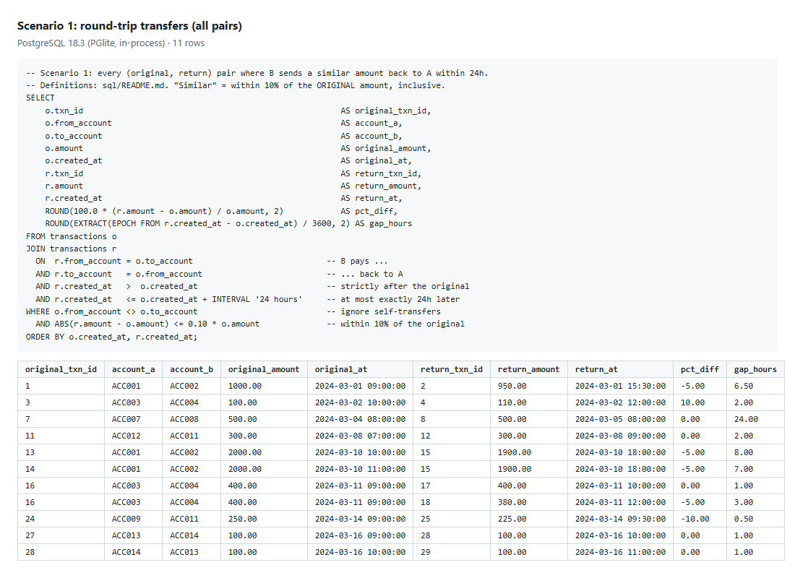

# Streamhub QA Automation assessment (Section B)

[](https://github.com/raghusharma1/QA_automation_assessment_streamhub/actions/workflows/ci.yml)
[](https://github.com/raghusharma1/QA_automation_assessment_streamhub/actions/workflows/live-ui.yml)

A Playwright + Cucumber ([playwright-bdd](https://vitalets.github.io/playwright-bdd/)) framework in
TypeScript that covers all of Section B: an IPL stats API and its API tests (B1, B2), the EMI
calculator UI tests (B3), two SQL scenarios (B4), and an AI self-healing proof of concept that is
validated against the live site. **Every expected value comes from an independent oracle**, never
from the system under test.

## Results

Committed run: **2026-10-06**, Windows 11, Node 22, Playwright 1.63, Chromium, against the live
emicalculator.net. Reports are in [`reports/`](reports) (open the HTML files locally: GitHub
doesn't render them) and are also uploaded as artifacts by every CI run.

| Suite                                          | Result                                   | Evidence                                                                                                                                                |
| ---------------------------------------------- | ---------------------------------------- | ------------------------------------------------------------------------------------------------------------------------------------------------------- |
| `unit`: EMI and amortization oracles, healer   | ✅ 39 / 39                               | [Playwright HTML](reports/playwright-html/index.html) · [JSON](reports/playwright-results.json)                                                         |
| `sql`: B4, both scenarios + 11 mutation checks | ✅ 21 / 21                               | [screenshots + raw output](sql/results) · [real `psql` transcripts](sql/results/psql)                                                                   |
| `api`: B2 against our B1 API                   | ✅ 78 / 78                               | [Cucumber HTML](reports/cucumber/index.html) · [JUnit](reports/cucumber/report.xml) · [coverage matrix](api/README.md#status-code-and-parameter-matrix) |
| `ui`: B3 TC1 + TC2 on the live site            | ✅ 5 / 5                                 | [Cucumber HTML](reports/cucumber/index.html) · [screenshots below](#evidence)                                                                           |
| `self-healing`: 5 broken locators + 1 control  | 🔴 6 / 6 fail **by design**              | [results](reports/self-healing/results.json) · [HTML](reports/self-healing/html/index.html)                                                             |
| AI healer on those 6 failures                  | 4 proposed · 1 refused · 1 needs a human | [healing report](self-heal/out/healing-report.md) · [patches](self-heal/out/patches) · [SELF_HEALING.md](SELF_HEALING.md)                               |

## Quick start

Requires Node 22+.

```bash
npm ci
npx playwright install chromium
npm test
```

`npm test` runs the `unit`, `sql`, `api` and `ui` projects. The API is started and stopped
automatically, SQL runs in-process on [PGlite](https://pglite.dev) (no database to install), and
no API key or `.env` file is needed. Other commands:

| Command                                                   | What it does                                                                               |
| --------------------------------------------------------- | ------------------------------------------------------------------------------------------ |
| `npm run test:ui` / `test:api` / `test:sql` / `test:unit` | one project                                                                                |
| `npm run test:ci`                                         | all four with `TEST_ENV=ci` (retries, 2 workers, longer timeouts)                          |
| `npm run test:broken`                                     | the deliberately broken self-healing suite (fails on purpose; separate config and reports) |
| `npm run heal`                                            | the AI healer on those failures (replays recorded model responses; no login or key needed) |
| `npm run lint:locators`                                   | static brittle-locator lint                                                                |
| `npm run check`                                           | `tsc`, type-aware ESLint, Prettier                                                         |
| `npm run api:start`                                       | the API on <http://localhost:3000>                                                         |
| `npm run report`                                          | open the last Playwright HTML report                                                       |
| `bash sql/scripts/run-in-docker.sh`                       | optional: run the SQL with real `psql` on `postgres:18` in a throwaway container           |

## Requirement → where it is

| Requirement                                                   | Where                                                                                                                                                                                                    |
| ------------------------------------------------------------- | -------------------------------------------------------------------------------------------------------------------------------------------------------------------------------------------------------- |
| Framework: feature, step definition and page object files     | [`features/`](features), [`src/steps/`](src/steps), [`src/pages/`](src/pages) (page + components)                                                                                                        |
| Environment config, no hardcoded URLs                         | [`env/local.env`](env/local.env), [`env/ci.env`](env/ci.env), validated in [`src/config/env.ts`](src/config/env.ts) (the only file that reads `process.env`)                                             |
| Dynamic, resilient locators                                   | role / label locators in [`EmiCalculatorPage.ts`](src/pages/EmiCalculatorPage.ts) and [`components/`](src/pages/components); enforced by `lint:locators --strict` in CI                                  |
| **B1** API with filter, sort, paginate, search and errors     | [`api/`](api) (Hono + zod), design and conventions in [`api/README.md`](api/README.md)                                                                                                                   |
| **B2** API tests: happy paths, invalid and edge cases, shapes | [`features/api/`](features/api), contracts in [`src/api-clients/contracts.ts`](src/api-clients/contracts.ts), "Covered by" matrix in [`api/README.md`](api/README.md)                                    |
| **B3 TC1** Home loan EMI + pie chart                          | [`emi-home-loan-pie-chart.feature`](features/ui/emi-home-loan-pie-chart.feature), oracle [`emi-math.ts`](src/support/emi-math.ts)                                                                        |
| **B3 TC2** Personal loan sliders, month, bars, tooltip        | [`emi-personal-loan-bar-chart.feature`](features/ui/emi-personal-loan-bar-chart.feature), [`SliderControl.ts`](src/pages/components/SliderControl.ts), [`BarChart.ts`](src/pages/components/BarChart.ts) |
| **B4** SQL with schema and output screenshots                 | [`sql/`](sql), results in [`sql/results/`](sql/results), definitions in [`sql/README.md`](sql/README.md)                                                                                                 |
| 3–5 broken locators, left broken                              | [`src/pages/legacy/LegacyEmiCalculatorPage.ts`](src/pages/legacy/LegacyEmiCalculatorPage.ts) (5 + a negative control)                                                                                    |
| Self-healing markdown (detection, prompt, validation) + POC   | [`SELF_HEALING.md`](SELF_HEALING.md), POC in [`self-heal/`](self-heal)                                                                                                                                   |
| Claude Code reflection                                        | [below](#claude-code-reflection), full log in [`docs/ai-log.md`](docs/ai-log.md)                                                                                                                         |
| Test execution results (report, screenshots, logs)            | [`reports/`](reports), [`sql/results/`](sql/results), [`self-heal/out/`](self-heal/out), [evidence below](#evidence)                                                                                     |

## Architecture



- **Runner.** `playwright-bdd` turns the feature files into Playwright tests. It uses Cucumber's
  own Gherkin parser and Cucumber expressions, and writes Cucumber HTML, JSON and JUnit reports.
  That is how the Cucumber requirement is met, while keeping Playwright's runner (fixtures,
  parallelism, retries, traces). The comparison with `@cucumber/cucumber` is in
  [docs/research/01](docs/research/01-framework-playwright-bdd.md).
- **Fixtures are the Cucumber "World".** A typed per-scenario `ctx` plus `emiPage`, `legacyPage`
  and `api`, injected into steps. The `page` fixture blocks ad, analytics and consent hosts, which
  removes most of the live site's flakiness.
- **Page objects are composed from components** (`LoanForm`, `SliderControl`, `MonthPicker`,
  `PieChart`, `BarChart`). Steps describe intent; components know the page.
- **Independent oracles.** [`emi-math.ts`](src/support/emi-math.ts) computes the EMI, totals and
  the yearly amortization schedule. It was unit-tested and pinned to values seen on the live site
  before any UI code existed. API expectations were counted by hand from the raw JSON and
  re-checked by a separate script; SQL expected rows were derived by hand before the queries ran.
- **Contracts independent of the API.** The test-side zod contracts are written by hand from the
  API docs, and an ESLint `no-restricted-imports` rule stops tests importing `api/` (and `api/`
  importing the test framework). If they shared schemas, a schema bug would make the API and its
  tests agree.
- **Mutation checks** prove the tests can fail: breaking the oracle, the API or a SQL boundary on
  purpose makes exactly the expected tests fail. The 11 SQL mutants are automated tests.
- **Separate self-healing config** ([`playwright.self-heal.config.ts`](playwright.self-heal.config.ts)),
  so the broken locators stay broken without making `npm test` red, and their reports never
  overwrite the main evidence.
- **CI** has two workflows. [`ci.yml`](.github/workflows/ci.yml) is the hard gate (check, strict
  locator lint, unit, sql, api) plus the self-healing run as non-blocking evidence.
  [`live-ui.yml`](.github/workflows/live-ui.yml) runs the live-site suite on every push and
  nightly. They are separate because a red live run can mean the external site changed or was
  down, which isn't a code failure.

## Key decisions and interpretations

| Topic                  | Decision                                                                                                                                                                                                                                           |
| ---------------------- | -------------------------------------------------------------------------------------------------------------------------------------------------------------------------------------------------------------------------------------------------- |
| Locators               | Tabs: `getByRole('link', { name, exact: true })`. Inputs: `getByLabel` (exact), then fill + Tab. Results use `#emiamount p` with a comment: the site gives the values no accessible name, so an id is the most stable option.                      |
| Sliders (TC2)          | The sliders are jQuery UI with no ARIA. The test drags to the computed position, then nudges with the keyboard until the bound input shows the exact value. It never uses `fill`, because the brief asks for the sliders.                          |
| Bar count (TC2)        | The bars are **stacked yearly columns** (principal + interest per calendar year). The count depends on the start month: January → 5 bars, June → 6. The month is chosen **relative to today** ("January of next year"), so the test never expires. |
| Chart values           | Highcharts 8.1: the test reads the visible DOM **and** the chart's data model and cross-checks both against the oracle. It waits for the chart to match the new inputs before asserting, so it can't pass on the previous chart.                   |
| Tooltip (TC2)          | Hover is retried until the tooltip appears; its text is compared with the oracle's value for that year and series.                                                                                                                                 |
| API (B1)               | `season` is **required** on `/api/matches`, so "missing required parameter" is a real test. Errors are RFC 9457 `application/problem+json`. Unknown parameters are rejected (400), other methods get 405 with `Allow: GET, HEAD`.                  |
| API data               | Illustrative IPL-2024-style sample data, labelled as such ([api/data/README.md](api/data/README.md)). The same data seeds SQL scenario 2, with a drift test.                                                                                       |
| SQL round trips (B4.1) | "Within 10%" is relative to the **original** amount, inclusive. The return is strictly after and at most exactly 24h later. All qualifying pairs, plus a one-to-one variant.                                                                       |
| SQL streaks (B4.2)     | Primary: 30+ in 3+ consecutive **appearances** (gaps and islands). Alternative: consecutive **team matches played** (a missed match breaks the streak; abandoned matches don't count). A LAG/LEAD version cross-checks the primary.                |
| SQL dialect            | PostgreSQL, run on PGlite in the `sql` project and verified on real `postgres:18`. Ordering uses an explicit collation, so results are identical on any server.                                                                                    |
| Self-healing           | A separate suite; the healer **proposes** patches and never applies them. Details in [SELF_HEALING.md](SELF_HEALING.md).                                                                                                                           |

## Evidence

**TC1, home loan pie chart** (₹25L at 10% for 10 years; both slices > 0, values checked against the oracle):



**TC2, personal loan bar chart** (₹10L at 12% for 5 years set with the sliders, schedule starting
January next year: 5 yearly bars), and the tooltip for the second year's interest, compared with
the amortization oracle:





The June schedule (6 bars, principal tooltip) and the second pie chart are in
[`docs/evidence/`](docs/evidence).

**B4 SQL, scenario 2** (players with 30+ runs in 3+ consecutive matches, with the streak start
date). All scenario outputs, schemas and `psql` transcripts are in [`sql/results/`](sql/results):





## Self-healing in one paragraph

Five locators in a legacy page object are broken in five realistic ways (ambiguous regex name,
renamed id, absolute XPath, positional CSS, drifted text), plus a **control** scenario whose
locator is fine but whose expected value is wrong. A static lint catches 3 of the 5 before
runtime. At runtime a deterministic classifier triages each failure, and only locator failures
reach the model (Claude, via headless Claude Code or the API). The model returns **structured
candidates, never code**, and each must pass eight gates: schema, grounded in the evidence it was
shown, stable (no circular data-as-identity), unique, exact preferred, visible, right role, and
**re-run 3 times** on the live site. Result: 4 patches proposed, the control **refused** before
any model call, and 1 honestly handed to a human. [SELF_HEALING.md](SELF_HEALING.md) also has a
measured comparison with Playwright's own Test Agents healer.

## Claude Code reflection

### How I used it

- **Research before code.** Parallel sub-agents compared runners, checked package versions on the
  npm registry, and ran candidate SQL on two engines. Their notes, with sources, are in
  [`docs/research/`](docs/research).
- **Live recon of the site** with `playwright-cli` before writing any page object
  ([06-live-recon-verified.md](docs/research/06-live-recon-verified.md)): accessible names, slider
  mechanics, chart internals, timing.
- **Pair programming**, milestone by milestone, test-first wherever there was logic.
- **An evaluator gate after every milestone:** a separate, read-only Claude agent briefed as a
  skeptical hiring-panel reviewer, with the assessment text and the architecture. I checked each
  finding myself, agreed or disagreed with reasons, and fixed in a separate commit. This was the
  single most valuable technique: it found a real problem at every milestone.
- **Claude as a component**: the self-healing POC calls Claude through headless Claude Code, with
  no tools and schema-constrained output.

Every case where AI helped, was wrong, or was corrected by review is logged in
[`docs/ai-log.md`](docs/ai-log.md). Six that shaped the project:

1. **A recon "fact" that wasn't one.** Live recon reported that
   `getByRole('link', { name: 'Personal Loan' })` matched 2 elements and failed strict mode, so I
   added `exact: true`. Later, when I planned it as a realistic broken locator, it passed: in every
   Playwright run it matches exactly one element. The 2-element result came from one exploratory
   session. I corrected the log instead of quietly dropping it. Lesson: one observation from an AI
   tool is a hypothesis, not a fact.
2. **The stale-chart race I missed.** My pie-chart "values > 0" step read the chart before the step
   that waited for the redraw. With a slow redraw it would have checked the site's _default_ chart,
   which is also > 0, and passed for the wrong reason. My mutation check had proven the tests catch
   a wrong oracle, but not a stale chart. The evaluator caught it, and every chart read now waits
   until the chart matches the oracle.
3. **The tests found a real bug in my API.** The property check "players sorted by name" failed:
   the sort compared UTF-16 code units, so "MS Dhoni" came before "Mohammed Siraj". Fixed with
   `Intl.Collator`. Later the evaluator found the same bug class in my SQL (PGlite's `C` collation):
   I hadn't carried the lesson across.
4. **A circular heal that passed every gate.** The healer accepted `getByText('₹44,986')` for the
   EMI value: unique, visible, and green on 3 re-runs. But it finds the element by the value the
   test asserts, so a wrong EMI would show up as a "missing element". I caught it reading the
   report, and added a **stability gate** (numbers are data, not identity).
5. **The biggest miss: a partly blind first live run.** The snapshot parser only recognised the
   format Playwright uses for _action_ failures, so for 3 of the 5 targets the model was told the
   page snapshot was "not available". I had tested the parser against a fixture I made up, and I
   wrote conclusions without reading the model's own rationales, which said so. **The evaluator
   caught it.** The parser is now tested against real error-context files, and the recorded
   responses store the full prompt so anyone can check what the model saw.
6. **"My recollection of the site's markup."** With the snapshot fixed, the model solved Broken 4
   with `#emiamount p` and wrote that the id was _"my recollection of the site's markup and is not
   in the snapshot"_. It was right, but from training data about a public site; on a private app
   the same behaviour invents ids. Asking the model to ground its answer is a request, not a
   guarantee, so a **grounding gate** now enforces it in code. Broken 4 is now an honest "needs a
   human".

### What worked

- **The evaluator loop.** It found real gaps at every milestone: B2 needed a _required_ parameter,
  shared schemas would have been circular, my API README claimed coverage that didn't exist, the
  SQL mutants only asserted absence, and the blind live run.
- **Independent oracles plus mutation checks.** They turned "the tests pass" into "the tests fail
  for the right reason".
- **Live recon before page objects.** It found the stale-value race, the legend symbols that would
  have inflated the bar count, and the slider mechanics before any test depended on them.
- **Checking AI claims against a source of truth**: the npm registry (TypeScript version,
  a hallucinated `@eslint/config` import), the raw JSON (two wrong hand counts), installed library
  source (playwright-bdd title formats).

### What didn't

- **The same escaping mistake, three times.** I edited TypeScript containing regexes through
  shell/Python heredocs, and `\b`, `\n` and `\r` became control bytes. A byte check (`cat -A`)
  caught it each time before running, but the lesson took three attempts: code edits go through
  the file tools only.
- **A sub-agent ran `taskkill /F /IM node.exe`**, killing every Node process on the machine. Now
  a standing rule: stop only processes you started, by PID.
- **Invented data.** I filled in Car Loan slider ranges that were never measured. Caught before
  running; the table now only allows measured products.
- **Wrong hand counts, twice**, in API expectations. Caught by a separate script that counts from
  the raw JSON.
- **Testing against synthetic fixtures** hid the self-healing blocker. Real artifacts only, now.
- **Replay isn't perfectly stable on a live site.** The healer's recorded prompts include the live
  accessibility snapshot, which varies slightly between runs, so Broken 1 reports "prompt changed
  since recording". The outcome is the same, and the report says so instead of hiding it.

## Project structure

```text
features/            Gherkin: ui/, api/, self-healing/
src/
  config/env.ts      the only reader of process.env (zod-validated)
  fixtures/          ctx, emiPage, legacyPage, api; third-party blocking
  pages/             EmiCalculatorPage + components/; legacy/ (broken on purpose)
  steps/             ui/, api/, self-healing/
  api-clients/       ApiClient + hand-written contracts
  support/           emi-math (oracles), inr (₹ formatting), third-party blocklist
api/                 B1: Hono + zod API over api/data/*.json
sql/                 B4: schema, seed, queries per scenario; results/; scripts/
self-heal/           healer POC: src/, cassettes/ (recorded model calls), out/, comparison/
tests/unit/          oracle and healer unit tests
tests/sql/           SQL scenario tests (PGlite) + mutation checks
env/                 local.env, ci.env (non-secret settings)
reports/             committed curated run
docs/                ai-log.md, research/, evidence/
```

## Troubleshooting

- **A live UI test fails.** emicalculator.net is a third-party site: an outage, a slow ad, or a
  markup change can fail it. CI retries twice; locally use `npm run test:ci`. If the
  [Live UI workflow](.github/workflows/live-ui.yml) is red but [CI](.github/workflows/ci.yml) is
  green, the site has probably changed: check the report's screenshot and trace first.
- **Docker is optional.** It is only used by `sql/scripts/run-in-docker.sh` to re-verify the SQL
  on real PostgreSQL.
- **The healer needs no login by default.** `npm run heal` replays the recorded model responses.
  A Claude Code login is needed only for `npm run heal -- --record` (a new live run), or set
  `ANTHROPIC_API_KEY` in `.env` (see [`.env.example`](.env.example)) and `HEAL_LLM=anthropic`.
- **Port 3000 in use.** Set `API_PORT` in `.env`.
